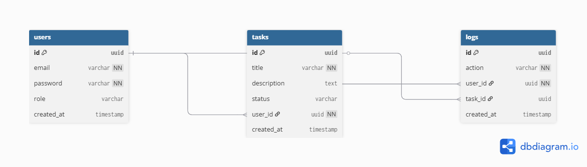

# Secure Rate-Limited API

A secure, production-ready REST API built with NestJS, featuring JWT authentication, global rate limiting, and comprehensive audit logging.

## Tech Stack

- **Framework:** [NestJS](https://nestjs.com/)
- **Language:** TypeScript
- **Database:** PostgreSQL
- **ORM:** TypeORM
- **Authentication:** Passport + JWT
- **Rate Limiting:** @nestjs/throttler
- **Validation:** class-validator

## Features

- **Secure Authentication:** User registration and login with JWT issuance.
- **Task Management:** CRUD operations for user-specific tasks.
- **Rate Limiting:** Global limit of 5 requests per minute per IP to prevent abuse.
- **Audit Logging:** Internal logging of critical actions (e.g., login, task creation).
- **Data Integrity:** Relationships between Users, Tasks, and Logs.

## Installation

    git clone <repository-url>
    npm install
    npm run start:dev

## Environment Variables
PORT=3000
DATABASE_HOST=localhost
DATABASE_PORT=5432
DATABASE_USER=postgres
DATABASE_PASSWORD=postgres
DATABASE_NAME=secure_api
JWT_SECRET=super_secret_key
JWT_EXPIRES_IN=1d

Create a `.env` file in the root directory:

## API Endpoints

### Auth & Users
- `POST /api/users/auth/register` - Register a new user
- `POST /api/users/auth/login` - Login and receive access token
- `GET /api/users/me` - Retrieve current user profile (requires Token)

### Tasks
- `POST /api/tasks/create-task` - Create a new task
- `GET /api/tasks/my-tasks` - Retrieve all tasks for the current user
- `GET /api/tasks/my-tasks/:id` - Retrieve a specific task
- `PATCH /api/tasks/update-task/:id` - Update a task
- `DELETE /api/tasks/delete-task/:id` - Delete a task

## Database Design

### Relationships
- **Users**: Can have multiple Tasks and Log entries.
- **Tasks**: Belong to one User.
- **Logs**: Record actions related to Users and Tasks.

## Security Considerations

- Passwords are hashed using bcrypt before storage.
- JWT-based authentication with protected routes.
- DTO-based validation to prevent malformed input.
- Rate limiting to protect against brute-force attacks.
- No sensitive data (passwords) returned in API responses.

## License

This project is UNLICENSED.
